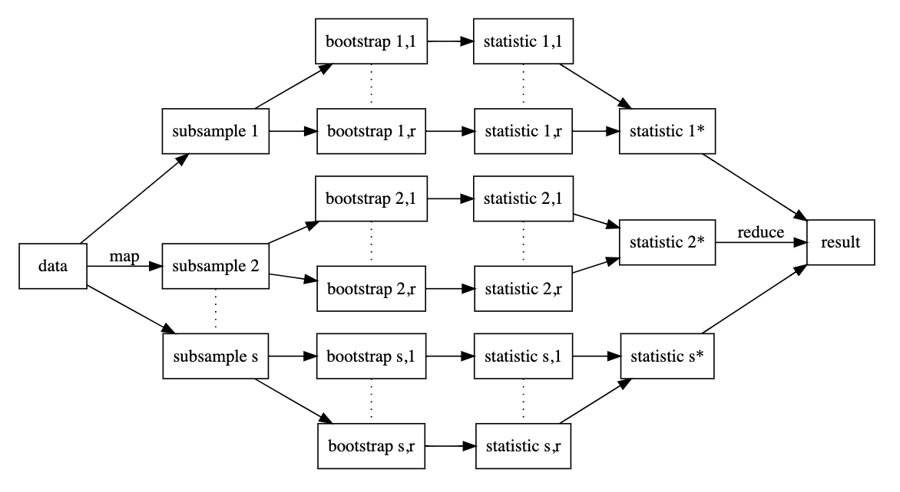

# Introduction

## Procedure

This package was built to fit a linear regression model that utilizes the methodology of bootstraping and subsampling. Bootstraping is often done by randomly sampling with replacement to create a large number of samples from the data. A statistic is then calculated for each of the bootstraps and reduced to the final result. Subsampling partitions the data by sampling without replacement, and likewise calculates a statistic for each of the subsamples and reduced to a final result. Both of these methods are efficient in calculating quality estimators and when applied in combination, it is referred to the Bag of Little Bootstraps (BLB). This diagram visually represents the BLB process:

```{r echo=FALSE, warning=FALSE, out.width = "90%"}

```

From the original dataset, this package will split the data into a specified number of subsamples. Then from each subsample, a specified number of bootstraps will be generated to resemble the same size of the original data. The statistics, or in this case, the linear model estimates will be calculated from each bootstrap. The estimates will be reduced down to each subsample, and finally reduced down to the final estimate. 


```{r setup}
library(newblblm)
```

This document will cover the usage and some possible applications of the package `newblblm`. Two datasets will be used through this demonstration: one is the built-in `mtcars` dataset, the other is from a package called `nycflights13`, in which the `flights` dataset will be used. 


## Parameters

`newblblm(formula, data, m = 10, B = 5000)`

### Formula
The formula should be formated as follows: `response ~ predictors`. This is consistent with the formula format used for the standard `lm()` function call. The formula parameter will accept any combination or linear mutations of a numeric variable from the dataset. This includes addition, multiplication, or logistic transformation. 

### Data
The data parameter should contain the dataset you wish to build the linear model on. The data input can take on two forms:
* A data frame: `data.frame` which contains the entire dataset. For example, the `mtcars` data frame.
* A vector list of file names: `character` each file should provide a subsample of the dataset. This is ideal for large datasets, such as the `flights` dataset which contains over 300,000 observations. The user would need to split the data into 10 files, each containing a subset of approximately 30,000 observations. The vector list of those 10 files can be used as input for the data argument (as shown in a later example).

### m
This parameter accepts an integer that will determine the number of subsets your data frame will be split into. However, if you have provided a list of file names, this integer should be consistent with the number of subsets you have provided as the function will not split your data again. 

### B
This parameter accepts an integer that will determine the number of bootstraps created in each subset. The regression coefficients will be calculated for each bootstrap and will be stored in your class newblblm object.


Build a model from the `mtcars` dataset:

```{r}
# Multiple predictors, with an interaction
fit <- newblblm(mpg ~ wt * hp, data = mtcars, m = 3, B = 100)
# Simple model
f <- newblblm(mpg ~ wt, mtcars, m = 3, B = 100)
```


## Parallel Computing

The user can utilize parallel computing in this package through `future_map`. This is espcially helpful to reduce the run time for large datasets or a large number of bootstraps. In order to prompt parallel computing, the user must specify their number of workers by running a line of code, such as:

```{r, warning=FALSE}
library(tidyverse)
library(furrr)
library(future)
plan(multiprocess, workers=2)
```

We can now build a model for the `flights` dataset in parallel. As explained earlier, to prepare a list of file names, we must pre-subset the data and create a vector of file names that we can later read.

```{r, message=FALSE, eval=FALSE}
m <- 10
groups <- sample(seq_len(m), nrow(nycflights13::flights), replace = TRUE)
dir.create("flights/", showWarnings = FALSE)
for (i in seq_len(m)) {
  write_csv(filter(nycflights13::flights, groups == i), str_c("flights/", i, ".csv"))
}
```

```{r}
file_names <- file.path("flights", list.files("flights"))
```

An example model using file names from the `flights` dataset:

```{r}
flightfit <- newblblm(dep_delay~arr_delay, data = file_names, m = 10, B = 100)
```


# Functions

## print

`print(object)`

The function print for class "newblblm" objects will simply print the formula of the model. 

```{r}
print(fit)
```

## coef

`coef(object)`

This function will return the final coefficient estimates calculated from the bag of little bootstraps.

```{r}
coef(fit)
```

## sigma

`sigma(object, confidence = FALSE, level = 0.95)`

This function will return the estimated sigma from the model. The default will only return the estimate, but the user can choose to return the confidence interval of the sigma estimate. The default level of confidence used will be 0.95, but can also be tuned by the user. 

```{r}
sigma(fit)
```
```{r}
sigma(fit, confidence = TRUE)
```

## confint

`confint(object, parm = NULL, level = 0.95)`

This function will return the confindence intervals for the parameters that you select. The default level of confidence used is 0.95, but can be changed by the user.

```{r}
confint(fit, c("wt", "hp"))
```

```{r}
confint(fit, c("wt", "hp"), level = 0.9)
```

## predict

`predict(object, new_data, confidence = FALSE, level = 0.95)`

This function predicts the value of new observations. At default the confidence interval will not be included, but can be opted-in by the user. The confidence interval will include the upper and lower bound estimates, as well as the fit estimate of the new data. Again, the level of confidence can be altered.

```{r}
# observation 1: wt = 2.5, hp = 150
# observation 2: wt = 3, hp = 170
predict(fit, data.frame(wt = c(2.5, 3), hp = c(150, 170)))
```

```{r}
predict(fit, data.frame(wt = c(2.5, 3), hp = c(150, 170)), confidence = TRUE)
```

## fitplot

`fitplot(object, data, boots = FALSE)`

This plot function will plot each observation in the data set as well as the linear regression model used to fit the data. This function only plots in 2-dimensional, so the parameter object will only accept a model with one predictor. 

```{r}
# fit: mpg ~ wt * hp
fitplot(fit, mtcars)
```

```{r, fig.width=5, fig.height= 4}
# f: mpg ~ wt
fitplot(f, mtcars)
```

You can also elect to plot the regression line calculated from each bootstrap. This can help visualize the unofficial "confidence interval" of the linear regression line, also getting a glimpse at the error between each bootstrap. 

```{r, fig.width=5, fig.height= 4}
fitplot(f, mtcars, boots = TRUE)
```

## coefplot

`coefplot(object, violin = FALSE, boots = FALSE, box = FALSE)`

This boxplot function provides a variety of distribution plots of the bootstrap coefficient estimates. There are three parameters that will control the output of the plot. 
* violin: violin plot for the density of the bootstrap estimates
* boots: scatter plot for each individual bootstrap estimate
* box: boxplot to summarize the distribution of the bootstrap estimates

```{r, fig.width=7, fig.height= 5}
coefplot(fit, box = TRUE)
```

```{r, fig.width=7, fig.height= 5}
coefplot(fit, violin = TRUE)
```

```{r, fig.width=7, fig.height= 5}
coefplot(fit, violin = TRUE, boots = TRUE)
```


# Conclusion

This package provides a reproducable way for users to compute a Bag of Little Bootstraps Linear Model. This procedure is a great way to calculate estimates from a dataset. The package was optimized with parallel computing and the option to provide file names of pre-subsampled data. In addition, plot functions were added to help the user better understand their BLB Linear Model. The plots provide insight to the individual models and of each bootstrap and the distribution estimates.  

